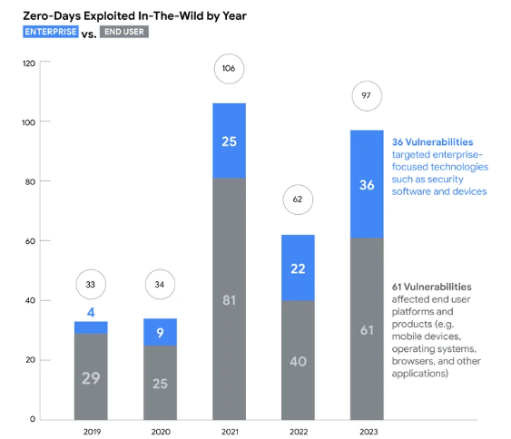

# Zero-day vulnerability

### What is a zero-day vulnerability?
A zero-day vulnerability is a vulnerability in a system or device that has been disclosed but is not yet patched. An exploit that attacks a zero-day vulnerability is called a zero-day exploit

Because they were discovered before security researchers and software developers became aware of them—and before they can issue a patch—zero-day vulnerabilities pose a higher risk to users for the following reasons:

* Cybercriminals race to exploit these vulnerabilities to cash in on their schemes
Vulnerable systems are exposed until a patch is issued by the vendor.
* Zero-day vulnerabilities are typically involved in targeted attacks; however, many campaigns still use old vulnerabilities.

Related terms : Exploit, Zero-day exploit, vulnerability

In 2023, Google observed 97 zero-day vulnerabilities exploited in-the-wild. That’s over 50% more than in 2022, but still shy of 2021’s record of 106. Today, Google published its fifth annual review of zero-days exploited in-the-wild, marking the first time Google’s Threat Analysis Group (TAG) and Mandiant teamed up on the report.

In the report, “We’re All in this Together: A Year in Review of Zero-Days Exploited In-the-Wild in 2023,” released today, we’re taking a broader look at this space with recommendations for others. TAG and Mandiant combined their expertise to analyze zero-days that were actively exploited against both end-user platforms and products (e.g. mobile devices, operating systems, browsers, and other applications) and enterprise-focused technologies such as security software and appliances.

The result, we hope, is not only a broader assessment but clear guidance for others committed to securing the digital world.

